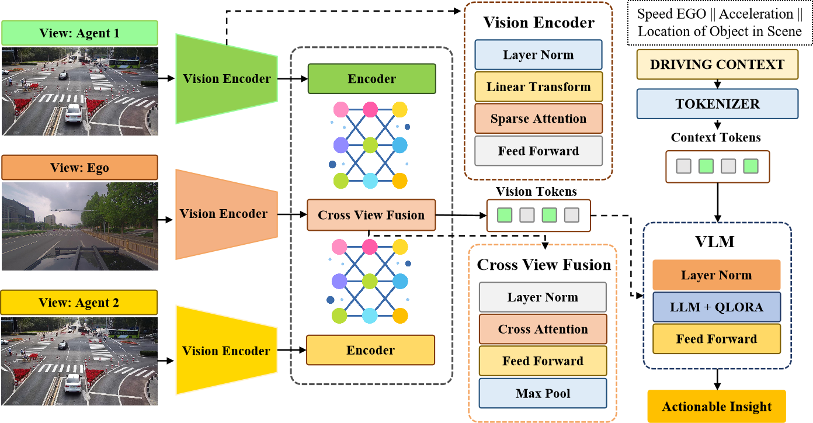
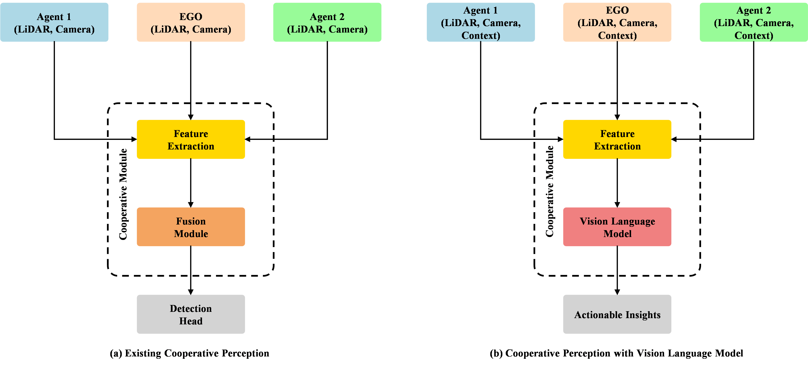
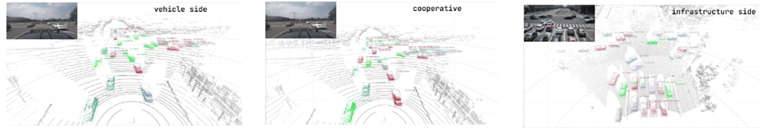
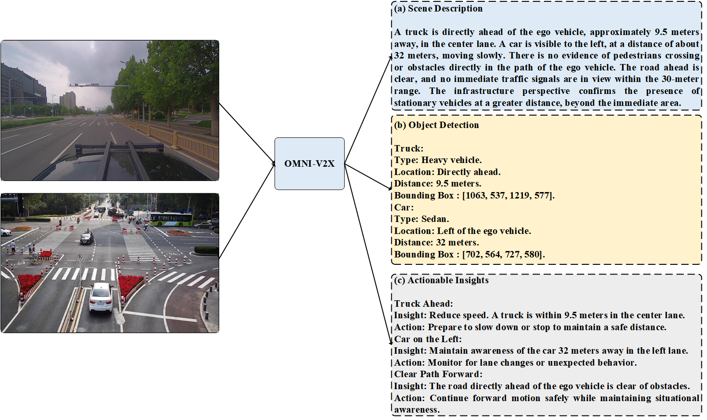

<div align="Justify">
  <div>&nbsp;</div>
  <h1>Omni-V2X: A Vision-Language Model for Actionable Insights in Vehicle-to-Everything Systems</h1>
  <p>
  Cooperative perception in autonomous driving enhances situational awareness by sharing multi-modal sensor data through Vehicle-to-Everything (V2X) communication. However, challenges like bandwidth limitations, computational constraints, and data heterogeneity hinder its adoption. This paper presents Omni-V2X, a vision-language framework that generates real-time, actionable scene descriptions by fusing multi-view images and driving context. Omni-V2X employs a spatially-aware cross-view attention mechanism and parameter-efficient processing, enabling deployment on in-vehicle edge computing units. It shares concise insights for navigation and decision-making, such as object detection and obstacle awareness. Experimental results on the DAIR-V2X-C dataset demonstrate state-of-the-art performance with ROUGE 55.3, BLEU 42.8, and AP 72.4, while maintaining low latency. The modular design ensures scalability and future integration with LiDAR and other modalities. This work advances robust, scalable, and context-aware cooperative perception for autonomous driving.
  </p>
  <div>&nbsp;</div>
  <p><a href="[https://papers.ssrn.com/sol3/papers.cfm?abstract_id=5038210](https://ieeexplore.ieee.org/document/11228491)"><strong>Read the paper here</strong></a></p>
  <div>&nbsp;</div>
</div>

---
<p align="center">
  
</p>


---
Traditional methods (see following figure) focus on single-frame onboard feature fusion for object detection or tracking, limiting their interpretability. In contrast, Omni-V2X incorporates cooperative features from multiple perspectives alongside driving context, enabling interpretable and actionable insights through a vision-language model while maintaining object detection capabilities.

<p align="center">
  
</p>

## 📰 News

- **11/29/2024**: We release Omni-V2X.

---

## ✅ Features

- **Sensor Modalities**:
  - [x] Camera + Driving Context 
  - [ ] LiDAR + Driving Context
  - [ ] Camera + LiDAR + Driving Context
  
- **Core Features**:
  - **Scene Description**: Generates natural language descriptions of the driving environment with detailed object interactions and spatial context.
  - **Object Detection**: Identifies and localizes objects with bounding boxes, class labels, and relative distances.
  - **Actionable Insights**: Provides navigation recommendations based on detected objects and scene context.
  - **Resource-Efficient**: Optimized for real-time inference on resource-constrained edge devices.
  - **Scalability**: Modular design supports integration of additional sensor modalities, such as LiDAR and radar.

---

## 📊 Highlights

- **Dataset**: Trained and evaluated on the DAIR-V2X-C dataset.
- **Performance Metrics**:
  - **BLEU-4**: **42.8**
  - **CIDEr**: **104.2**
  - **Object Detection AP@50**: **72.4**
  - **Real-time latency**: **37.8ms per frame**
- **Key Innovations**:
  - Multiview and cross-view attention for spatial alignment.
  - Modular and parameter-efficient architecture for scalability.
  - Enhanced interpretability for autonomous driving scenarios.

---

## 📂 Data Downloading
We use the DAIR-V2X dataset, a benchmark for collaborative perception in autonomous driving. As shown in Figure 3, the dataset provides RGB images, LiDAR point clouds, and calibration files to enable accurate projection between coordinate systems. Annotations include 3D bounding boxes for vehicles, pedestrians, cyclists, and other objects in urban
traffic environments, such as intersections and multi-lane roads. For more details, explore the [DAIR-V2X dataset here](https://thudair.baai.ac.cn/login).
<p align="center">
  
</p>

---

## 🧪 Experimental Results

### Quantitative Metrics

| **Metric**         | **Pre-trained Phi-3.5** | **Omni-V2X (Ours)** |
|---------------------|-------------------------|---------------------|
| **BLEU-4**         | 32.4                   | **42.8**            |
| **CIDEr**          | 82.1                   | **104.2**           |
| **AP@50 IoU**      | 58.3                   | **72.4**            |
| **Latency (ms)**    | 35.3                   | **37.8**            |

### Qualitative Outputs

<p align="center">
  
</p>

- **Scene Description**: "A truck is directly ahead of the ego vehicle, approximately 9.5 meters away, in the center lane..."
- **Actionable Insights**: "Reduce speed for the truck ahead in the center lane."

---

## 📜 Citation

If you are using our Omni-V2X framework for your research, please cite the following paper:

```bibtex
@INPROCEEDINGS{11228491,
  author={Mayumu, Nicanor and Xiaoheng, Deng and Mukala, Patrick and Khan, Saif Ur Rehman and Saeed, Muhammad Usman},
  booktitle={2025 International Joint Conference on Neural Networks (IJCNN)}, 
  title={Omni-V2X: A Vision-Language Model for Actionable Insights in Vehicle-to-Everything Systems}, 
  year={2025},
  volume={},
  number={},
  pages={1-8},
  keywords={Laser radar;Navigation;Scalability;Decision making;Object detection;Computer architecture;Safety;Vehicle dynamics;Vehicle-to-everything;Autonomous vehicles;Cooperative Perception;Multi-View image;Vehicle-to-Everything Systems;Vision-Language Models;Scene Understanding},
  doi={10.1109/IJCNN64981.2025.11228491}}


🤝 Acknowledgments
This work was supported by the National Natural Science Foundation of China Project (62172441, 62172449). The authors thank the High Performance Computing Center of Central South University for providing computational resources utilized in this study. 

🚧 Code Coming Soon...
The code for Omni-V2X will be shared soon. Stay tuned!
